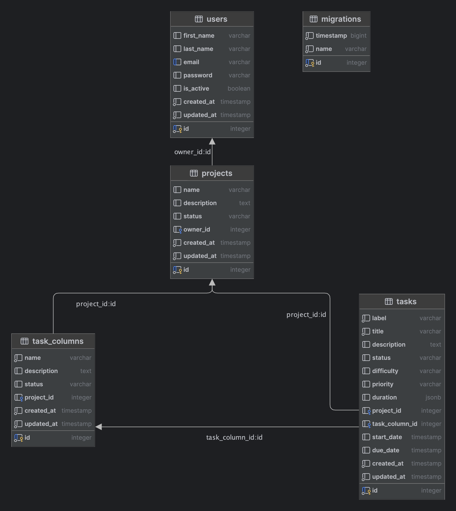

# Task Management Backend

A RESTful API for a simple task management system

## Table of Contents

- [Getting Started](#getting-started)
- [Installation And Setup](#installation-and-setup)
- [ERD](#erd)
- [API Documentation](#api-documentation)

## Getting Started

This is a basic Project and Task Management API that lets you create a project, add task columns and then create tasks.

## Installation And Setup

1. Clone the repository:

   ```bash
   git clone https://github.com/francosion042/Task-Management-BE.git
   ```

2. Install dependencies:

   ```bash
   cd Task-Management-BE
   npm install
   ```

3. Create a .env file and add the following

    ```json
    NODE_ENV=development
    DB_HOST=localhost
    DB_PORT=5432
    DB_NAME=TaskManagement
    DB_USERNAME=postgres
    DB_PASSWORD=
    ENABLE_ORM_LOGS=false
    JWT_SECRET=secret
    ```

4. Create a database, test connection and run migration to create tables

    ```bash
    npm run migration:run
    ```

## ERD

<!--  -->
<p align="center">
  
</p>

The Entity Relationship Diagram (ERD) above summarizes the data structure and model of this project.

## API Documentation

[API Documentation](https://documenter.getpostman.com/view/7759986/2sA3JT1d9S)

Sample Screenshots of the Socket connection are in the documentation folder as i'm unable to publish or export the Socket collection from Postman
